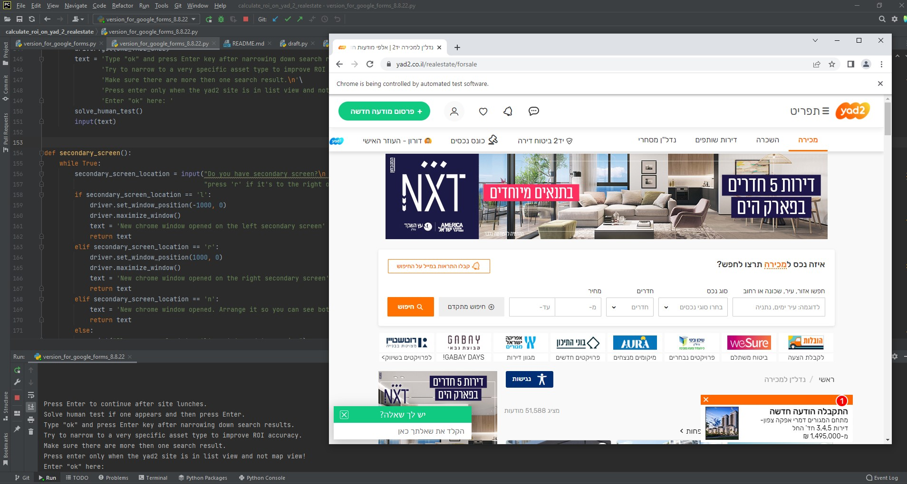
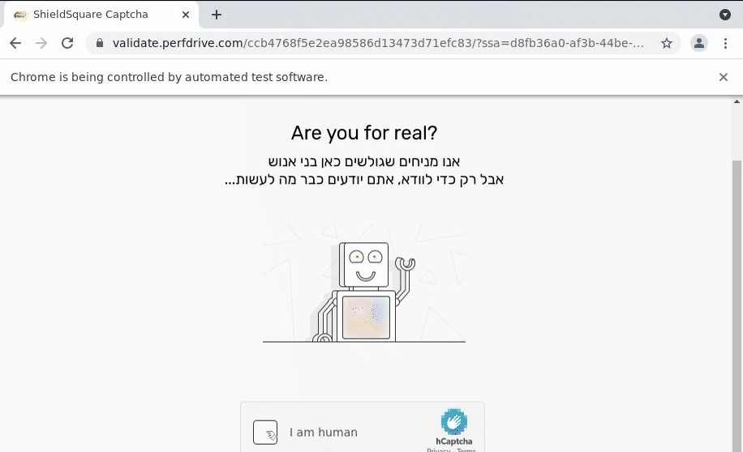
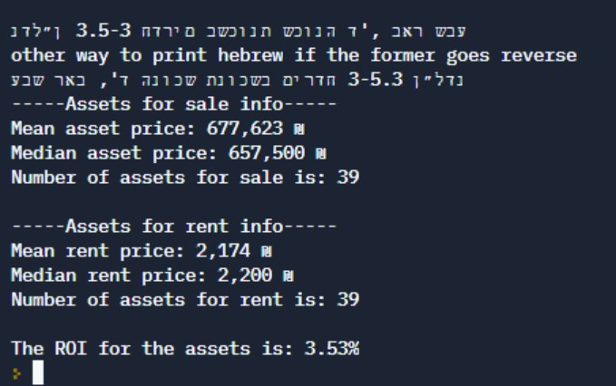

# ROI calculation for real estate in Israel

This software will find the Return On Investment (ROI) for real estate investment in Israel. 

The user will adjust the search criteria using yad2 site for the preferable real 
estate type for example: A 3 to 4 rooms appartment with balcony in Bat-Yam. 

Once selected the Selenium webdriver will navigate throu the site, 
find the relevant rental options in this area that will make profit from the selected real
estate criteria. With this information the software will conduct calculation for the ROI.
The result with the search criteria will be return to the user and a log will be saved
in an open to view google sheet.

With this program you can calculate the following:
Median and Mean price for Assets for sale and rentals for your search query.
Number of assets for sale and rent.
The calculated ROI - return on investment calculate by dividing 
11 mean rent month by the mean asset price.

## Installation

To run this the user need to have an IDE such as PyCharm, 
Google Crome and the path for chromedrive in the environment
variables. explanation on that here: https://chromedriver.chromium.org/getting-started 

## Run Locally

Clone the project and follow the instraction on the run window in the IDE. A pop-up
window of Chrome will open after starting the program. There you will narrow down the
search criteria. Pay attention to the prompts given in the IDE run screen. This is the 
program interface. 

If chose to run with Replit and not locally in IDE use this  blogpost 
in hebrew for further explanation about Replit
https://nadlandata.com/2022/01/02/6-%d7%aa%d7%a9%d7%95%d7%90%d7%94-%d7%a4%d7%99%d7%a8%d7%95%d7%aa%d7%99%d7%aa-%d7%97%d7%99%d7%a9%d7%95%d7%91-%d7%90%d7%95%d7%98%d7%95%d7%9e%d7%98%d7%99-%d7%91%d7%a2%d7%96%d7%a8%d7%aa-selenium/

## Usage/Examples

To operate this program you will have to respond to propts from the IDE run window and fill
search query in the yad2 site. During work it shuld look something like this:

In order to deal with CAPTCHA  the webdriver will ask the user to solze
the puzzels given by the yad2 site such as this one:

The output from the calculation will be print with the calculated info for 
the user search query:

## License

[MIT](https://choosealicense.com/licenses/mit/)

